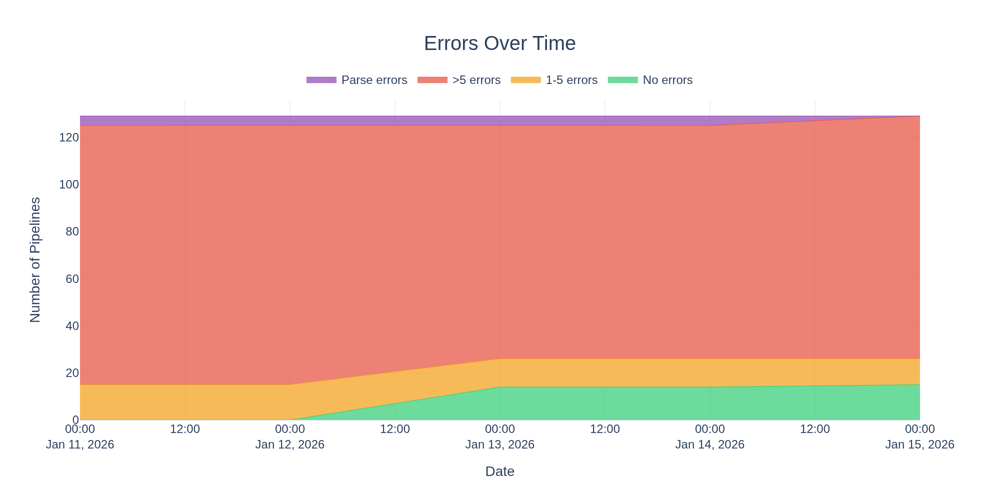
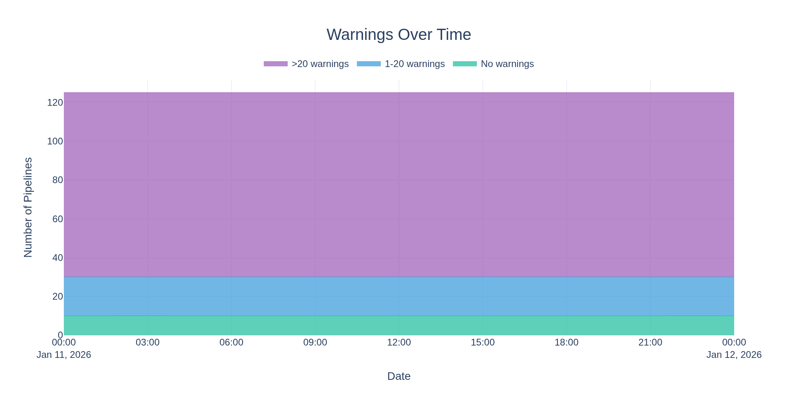

# nf-core Strict Syntax Health Report

This repository tracks the health of nf-core pipelines with respect to Nextflow's strict syntax linting.

**Last updated:** 2026-01-12 21:54:43 UTC

**Nextflow version:** 25.12.0-edge

**Total:** 4 parse errors, 4146 errors, 9669 warnings across 129 pipelines

## Trends

### Errors

### Warnings

## Results

| Pipeline                                                                          | Parse Error | Errors | Warnings |                       Lint Output                       |
| --------------------------------------------------------------------------------- | :---------: | -----: | -------: | :-----------------------------------------------------: |
| [proteinannotator](https://github.com/nf-core/proteinannotator)                   |     No      |      1 |        9 |     [View](lint_results/proteinannotator_lint.txt)      |
| [createpanelrefs](https://github.com/nf-core/createpanelrefs)                     |     No      |      1 |       15 |      [View](lint_results/createpanelrefs_lint.txt)      |
| [rnavar](https://github.com/nf-core/rnavar)                                       |     No      |      1 |       17 |          [View](lint_results/rnavar_lint.txt)           |
| [ribomsqc](https://github.com/nf-core/ribomsqc)                                   |     No      |      1 |       27 |         [View](lint_results/ribomsqc_lint.txt)          |
| [createtaxdb](https://github.com/nf-core/createtaxdb)                             |     No      |      1 |       35 |        [View](lint_results/createtaxdb_lint.txt)        |
| [mag](https://github.com/nf-core/mag)                                             |     No      |      1 |       35 |            [View](lint_results/mag_lint.txt)            |
| [molkart](https://github.com/nf-core/molkart)                                     |     No      |      1 |       63 |          [View](lint_results/molkart_lint.txt)          |
| [methylong](https://github.com/nf-core/methylong)                                 |     No      |      1 |       81 |         [View](lint_results/methylong_lint.txt)         |
| [seqinspector](https://github.com/nf-core/seqinspector)                           |     No      |      2 |       14 |       [View](lint_results/seqinspector_lint.txt)        |
| [seqsubmit](https://github.com/nf-core/seqsubmit)                                 |     No      |      2 |       32 |         [View](lint_results/seqsubmit_lint.txt)         |
| [taxprofiler](https://github.com/nf-core/taxprofiler)                             |     No      |      2 |      140 |        [View](lint_results/taxprofiler_lint.txt)        |
| [scdownstream](https://github.com/nf-core/scdownstream)                           |     No      |      3 |       30 |       [View](lint_results/scdownstream_lint.txt)        |
| [reportho](https://github.com/nf-core/reportho)                                   |     No      |      3 |       90 |         [View](lint_results/reportho_lint.txt)          |
| [methylarray](https://github.com/nf-core/methylarray)                             |     No      |      4 |       19 |        [View](lint_results/methylarray_lint.txt)        |
| [methylseq](https://github.com/nf-core/methylseq)                                 |     No      |      4 |       65 |         [View](lint_results/methylseq_lint.txt)         |
| [gwas](https://github.com/nf-core/gwas)                                           |     No      |      6 |       16 |           [View](lint_results/gwas_lint.txt)            |
| [kmermaid](https://github.com/nf-core/kmermaid)                                   |     No      |      6 |       16 |         [View](lint_results/kmermaid_lint.txt)          |
| [mitodetect](https://github.com/nf-core/mitodetect)                               |     No      |      6 |       16 |        [View](lint_results/mitodetect_lint.txt)         |
| [panoramaseq](https://github.com/nf-core/panoramaseq)                             |     No      |      6 |       16 |        [View](lint_results/panoramaseq_lint.txt)        |
| [troughgraph](https://github.com/nf-core/troughgraph)                             |     No      |      6 |       16 |        [View](lint_results/troughgraph_lint.txt)        |
| [variantprioritization](https://github.com/nf-core/variantprioritization)         |     No      |      7 |       14 |   [View](lint_results/variantprioritization_lint.txt)   |
| [demo](https://github.com/nf-core/demo)                                           |     No      |      7 |       17 |           [View](lint_results/demo_lint.txt)            |
| [fastquorum](https://github.com/nf-core/fastquorum)                               |     No      |      7 |       28 |        [View](lint_results/fastquorum_lint.txt)         |
| [bamtofastq](https://github.com/nf-core/bamtofastq)                               |     No      |      7 |       42 |        [View](lint_results/bamtofastq_lint.txt)         |
| [lsmquant](https://github.com/nf-core/lsmquant)                                   |     No      |      7 |       54 |         [View](lint_results/lsmquant_lint.txt)          |
| [tfactivity](https://github.com/nf-core/tfactivity)                               |     No      |      7 |       57 |        [View](lint_results/tfactivity_lint.txt)         |
| [longraredisease](https://github.com/nf-core/longraredisease)                     |     No      |      7 |      121 |      [View](lint_results/longraredisease_lint.txt)      |
| [phaseimpute](https://github.com/nf-core/phaseimpute)                             |     No      |      7 |      237 |        [View](lint_results/phaseimpute_lint.txt)        |
| [cellpainting](https://github.com/nf-core/cellpainting)                           |     No      |      8 |       35 |       [View](lint_results/cellpainting_lint.txt)        |
| [pairgenomealign](https://github.com/nf-core/pairgenomealign)                     |     No      |      9 |       36 |      [View](lint_results/pairgenomealign_lint.txt)      |
| [tumourevo](https://github.com/nf-core/tumourevo)                                 |     No      |     10 |       56 |         [View](lint_results/tumourevo_lint.txt)         |
| [mhcquant](https://github.com/nf-core/mhcquant)                                   |     No      |     10 |       80 |         [View](lint_results/mhcquant_lint.txt)          |
| [proteinfamilies](https://github.com/nf-core/proteinfamilies)                     |     No      |     11 |       19 |      [View](lint_results/proteinfamilies_lint.txt)      |
| [nanostring](https://github.com/nf-core/nanostring)                               |     No      |     11 |       35 |        [View](lint_results/nanostring_lint.txt)         |
| [rangeland](https://github.com/nf-core/rangeland)                                 |     No      |     11 |       79 |         [View](lint_results/rangeland_lint.txt)         |
| [ampliseq](https://github.com/nf-core/ampliseq)                                   |     No      |     11 |      246 |         [View](lint_results/ampliseq_lint.txt)          |
| [smrnaseq](https://github.com/nf-core/smrnaseq)                                   |     No      |     12 |       74 |         [View](lint_results/smrnaseq_lint.txt)          |
| [pacvar](https://github.com/nf-core/pacvar)                                       |     No      |     13 |       56 |          [View](lint_results/pacvar_lint.txt)           |
| [drop](https://github.com/nf-core/drop)                                           |     No      |     13 |       77 |           [View](lint_results/drop_lint.txt)            |
| [variantbenchmarking](https://github.com/nf-core/variantbenchmarking)             |     No      |     13 |      144 |    [View](lint_results/variantbenchmarking_lint.txt)    |
| [sopa](https://github.com/nf-core/sopa)                                           |     No      |     14 |       17 |           [View](lint_results/sopa_lint.txt)            |
| [drugresponseeval](https://github.com/nf-core/drugresponseeval)                   |     No      |     14 |       41 |     [View](lint_results/drugresponseeval_lint.txt)      |
| [tbanalyzer](https://github.com/nf-core/tbanalyzer)                               |     No      |     14 |       47 |        [View](lint_results/tbanalyzer_lint.txt)         |
| [detaxizer](https://github.com/nf-core/detaxizer)                                 |     No      |     14 |       61 |         [View](lint_results/detaxizer_lint.txt)         |
| [pangenome](https://github.com/nf-core/pangenome)                                 |     No      |     14 |       63 |         [View](lint_results/pangenome_lint.txt)         |
| [rnafusion](https://github.com/nf-core/rnafusion)                                 |     No      |     14 |      116 |         [View](lint_results/rnafusion_lint.txt)         |
| [funcscan](https://github.com/nf-core/funcscan)                                   |     No      |     14 |      124 |         [View](lint_results/funcscan_lint.txt)          |
| [circrna](https://github.com/nf-core/circrna)                                     |     No      |     14 |      157 |          [View](lint_results/circrna_lint.txt)          |
| [clipseq](https://github.com/nf-core/clipseq)                                     |     No      |     15 |        0 |          [View](lint_results/clipseq_lint.txt)          |
| [dualrnaseq](https://github.com/nf-core/dualrnaseq)                               |     No      |     15 |        0 |        [View](lint_results/dualrnaseq_lint.txt)         |
| [imcyto](https://github.com/nf-core/imcyto)                                       |     No      |     15 |        0 |          [View](lint_results/imcyto_lint.txt)           |
| [mnaseseq](https://github.com/nf-core/mnaseseq)                                   |     No      |     15 |        0 |         [View](lint_results/mnaseseq_lint.txt)          |
| [proteogenomicsdb](https://github.com/nf-core/proteogenomicsdb)                   |     No      |     15 |        0 |     [View](lint_results/proteogenomicsdb_lint.txt)      |
| [spatialvi](https://github.com/nf-core/spatialvi)                                 |     No      |     15 |       20 |         [View](lint_results/spatialvi_lint.txt)         |
| [hlatyping](https://github.com/nf-core/hlatyping)                                 |     No      |     15 |       23 |         [View](lint_results/hlatyping_lint.txt)         |
| [diaproteomics](https://github.com/nf-core/diaproteomics)                         |     No      |     16 |        0 |       [View](lint_results/diaproteomics_lint.txt)       |
| [cageseq](https://github.com/nf-core/cageseq)                                     |     No      |     17 |        0 |          [View](lint_results/cageseq_lint.txt)          |
| [slamseq](https://github.com/nf-core/slamseq)                                     |     No      |     17 |        0 |          [View](lint_results/slamseq_lint.txt)          |
| [genomeassembler](https://github.com/nf-core/genomeassembler)                     |     No      |     17 |       93 |      [View](lint_results/genomeassembler_lint.txt)      |
| [phyloplace](https://github.com/nf-core/phyloplace)                               |     No      |     18 |      106 |        [View](lint_results/phyloplace_lint.txt)         |
| [scrnaseq](https://github.com/nf-core/scrnaseq)                                   |     No      |     18 |      126 |         [View](lint_results/scrnaseq_lint.txt)          |
| [datasync](https://github.com/nf-core/datasync)                                   |     No      |     19 |       20 |         [View](lint_results/datasync_lint.txt)          |
| [metapep](https://github.com/nf-core/metapep)                                     |     No      |     20 |       38 |          [View](lint_results/metapep_lint.txt)          |
| [epitopeprediction](https://github.com/nf-core/epitopeprediction)                 |     No      |     21 |       36 |     [View](lint_results/epitopeprediction_lint.txt)     |
| [mcmicro](https://github.com/nf-core/mcmicro)                                     |     No      |     22 |       48 |          [View](lint_results/mcmicro_lint.txt)          |
| [sammyseq](https://github.com/nf-core/sammyseq)                                   |     No      |     22 |      148 |         [View](lint_results/sammyseq_lint.txt)          |
| [fastqrepair](https://github.com/nf-core/fastqrepair)                             |     No      |     26 |       28 |        [View](lint_results/fastqrepair_lint.txt)        |
| [abotyper](https://github.com/nf-core/abotyper)                                   |     No      |     27 |       64 |         [View](lint_results/abotyper_lint.txt)          |
| [magmap](https://github.com/nf-core/magmap)                                       |     No      |     27 |       70 |          [View](lint_results/magmap_lint.txt)           |
| [bactmap](https://github.com/nf-core/bactmap)                                     |     No      |     28 |       64 |          [View](lint_results/bactmap_lint.txt)          |
| [bacass](https://github.com/nf-core/bacass)                                       |     No      |     28 |      131 |          [View](lint_results/bacass_lint.txt)           |
| [stableexpression](https://github.com/nf-core/stableexpression)                   |     No      |     29 |       36 |     [View](lint_results/stableexpression_lint.txt)      |
| [viralmetagenome](https://github.com/nf-core/viralmetagenome)                     |     No      |     30 |      246 |      [View](lint_results/viralmetagenome_lint.txt)      |
| [denovotranscript](https://github.com/nf-core/denovotranscript)                   |     No      |     31 |       51 |     [View](lint_results/denovotranscript_lint.txt)      |
| [alleleexpression](https://github.com/nf-core/alleleexpression)                   |     No      |     32 |       37 |     [View](lint_results/alleleexpression_lint.txt)      |
| [multiplesequencealign](https://github.com/nf-core/multiplesequencealign)         |     No      |     32 |      158 |   [View](lint_results/multiplesequencealign_lint.txt)   |
| [rnadnavar](https://github.com/nf-core/rnadnavar)                                 |     No      |     32 |      371 |         [View](lint_results/rnadnavar_lint.txt)         |
| [rarevariantburden](https://github.com/nf-core/rarevariantburden)                 |     No      |     33 |       22 |     [View](lint_results/rarevariantburden_lint.txt)     |
| [nascent](https://github.com/nf-core/nascent)                                     |     No      |     33 |      161 |          [View](lint_results/nascent_lint.txt)          |
| [raredisease](https://github.com/nf-core/raredisease)                             |     No      |     33 |      373 |        [View](lint_results/raredisease_lint.txt)        |
| [genomeqc](https://github.com/nf-core/genomeqc)                                   |     No      |     34 |      101 |         [View](lint_results/genomeqc_lint.txt)          |
| [proteomicslfq](https://github.com/nf-core/proteomicslfq)                         |     No      |     36 |        0 |       [View](lint_results/proteomicslfq_lint.txt)       |
| [isoseq](https://github.com/nf-core/isoseq)                                       |     No      |     36 |       13 |          [View](lint_results/isoseq_lint.txt)           |
| [references](https://github.com/nf-core/references)                               |     No      |     36 |       57 |        [View](lint_results/references_lint.txt)         |
| [circdna](https://github.com/nf-core/circdna)                                     |     No      |     38 |       30 |          [View](lint_results/circdna_lint.txt)          |
| [coproid](https://github.com/nf-core/coproid)                                     |     No      |     38 |       58 |          [View](lint_results/coproid_lint.txt)          |
| [genomeskim](https://github.com/nf-core/genomeskim)                               |     No      |     40 |       13 |        [View](lint_results/genomeskim_lint.txt)         |
| [lncpipe](https://github.com/nf-core/lncpipe)                                     |     No      |     41 |      176 |          [View](lint_results/lncpipe_lint.txt)          |
| [omicsgenetraitassociation](https://github.com/nf-core/omicsgenetraitassociation) |     No      |     44 |       30 | [View](lint_results/omicsgenetraitassociation_lint.txt) |
| [viralrecon](https://github.com/nf-core/viralrecon)                               |     No      |     44 |      188 |        [View](lint_results/viralrecon_lint.txt)         |
| [pathogensurveillance](https://github.com/nf-core/pathogensurveillance)           |     No      |     44 |      486 |   [View](lint_results/pathogensurveillance_lint.txt)    |
| [radseq](https://github.com/nf-core/radseq)                                       |     No      |     45 |       42 |          [View](lint_results/radseq_lint.txt)           |
| [meerpipe](https://github.com/nf-core/meerpipe)                                   |     No      |     45 |       84 |         [View](lint_results/meerpipe_lint.txt)          |
| [crisprseq](https://github.com/nf-core/crisprseq)                                 |     No      |     46 |       92 |         [View](lint_results/crisprseq_lint.txt)         |
| [fetchngs](https://github.com/nf-core/fetchngs)                                   |     No      |     47 |       25 |         [View](lint_results/fetchngs_lint.txt)          |
| [differentialabundance](https://github.com/nf-core/differentialabundance)         |     No      |     48 |       10 |   [View](lint_results/differentialabundance_lint.txt)   |
| [spinningjenny](https://github.com/nf-core/spinningjenny)                         |     No      |     50 |        9 |       [View](lint_results/spinningjenny_lint.txt)       |
| [riboseq](https://github.com/nf-core/riboseq)                                     |     No      |     53 |      158 |          [View](lint_results/riboseq_lint.txt)          |
| [readsimulator](https://github.com/nf-core/readsimulator)                         |     No      |     54 |       49 |       [View](lint_results/readsimulator_lint.txt)       |
| [demultiplex](https://github.com/nf-core/demultiplex)                             |     No      |     55 |       42 |        [View](lint_results/demultiplex_lint.txt)        |
| [variantcatalogue](https://github.com/nf-core/variantcatalogue)                   |     No      |     55 |       48 |     [View](lint_results/variantcatalogue_lint.txt)      |
| [hgtseq](https://github.com/nf-core/hgtseq)                                       |     No      |     58 |       58 |          [View](lint_results/hgtseq_lint.txt)           |
| [nanoseq](https://github.com/nf-core/nanoseq)                                     |     No      |     59 |       60 |          [View](lint_results/nanoseq_lint.txt)          |
| [phageannotator](https://github.com/nf-core/phageannotator)                       |     No      |     60 |       98 |      [View](lint_results/phageannotator_lint.txt)       |
| [proteinfold](https://github.com/nf-core/proteinfold)                             |     No      |     63 |       71 |        [View](lint_results/proteinfold_lint.txt)        |
| [metatdenovo](https://github.com/nf-core/metatdenovo)                             |     No      |     65 |      157 |        [View](lint_results/metatdenovo_lint.txt)        |
| [spatialxe](https://github.com/nf-core/spatialxe)                                 |     No      |     66 |       25 |         [View](lint_results/spatialxe_lint.txt)         |
| [metaboigniter](https://github.com/nf-core/metaboigniter)                         |     No      |     66 |      131 |       [View](lint_results/metaboigniter_lint.txt)       |
| [diseasemodulediscovery](https://github.com/nf-core/diseasemodulediscovery)       |     No      |     70 |       80 |  [View](lint_results/diseasemodulediscovery_lint.txt)   |
| [hic](https://github.com/nf-core/hic)                                             |     No      |     74 |       65 |            [View](lint_results/hic_lint.txt)            |
| [scnanoseq](https://github.com/nf-core/scnanoseq)                                 |     No      |     74 |      140 |         [View](lint_results/scnanoseq_lint.txt)         |
| [evexplorer](https://github.com/nf-core/evexplorer)                               |     No      |     75 |       53 |        [View](lint_results/evexplorer_lint.txt)         |
| [rnasplice](https://github.com/nf-core/rnasplice)                                 |     No      |     77 |      175 |         [View](lint_results/rnasplice_lint.txt)         |
| [chipseq](https://github.com/nf-core/chipseq)                                     |     No      |     79 |      178 |          [View](lint_results/chipseq_lint.txt)          |
| [viralintegration](https://github.com/nf-core/viralintegration)                   |     No      |     80 |       24 |     [View](lint_results/viralintegration_lint.txt)      |
| [marsseq](https://github.com/nf-core/marsseq)                                     |     No      |     81 |       61 |          [View](lint_results/marsseq_lint.txt)          |
| [callingcards](https://github.com/nf-core/callingcards)                           |     No      |     81 |      163 |       [View](lint_results/callingcards_lint.txt)        |
| [genomeannotator](https://github.com/nf-core/genomeannotator)                     |     No      |     85 |      148 |      [View](lint_results/genomeannotator_lint.txt)      |
| [rnaseq](https://github.com/nf-core/rnaseq)                                       |     No      |     85 |      299 |          [View](lint_results/rnaseq_lint.txt)           |
| [hicar](https://github.com/nf-core/hicar)                                         |     No      |     89 |      122 |           [View](lint_results/hicar_lint.txt)           |
| [eager](https://github.com/nf-core/eager)                                         |     No      |     96 |        0 |           [View](lint_results/eager_lint.txt)           |
| [cutandrun](https://github.com/nf-core/cutandrun)                                 |     No      |     97 |       75 |         [View](lint_results/cutandrun_lint.txt)         |
| [atacseq](https://github.com/nf-core/atacseq)                                     |     No      |    118 |      200 |          [View](lint_results/atacseq_lint.txt)          |
| [deepmutscan](https://github.com/nf-core/deepmutscan)                             |     No      |    122 |      118 |        [View](lint_results/deepmutscan_lint.txt)        |
| [oncoanalyser](https://github.com/nf-core/oncoanalyser)                           |     No      |    306 |      102 |       [View](lint_results/oncoanalyser_lint.txt)        |
| [airrflow](https://github.com/nf-core/airrflow)                                   |     Yes     |      - |        - |         [View](lint_results/airrflow_lint.txt)          |
| [deepmodeloptim](https://github.com/nf-core/deepmodeloptim)                       |     Yes     |      - |        - |      [View](lint_results/deepmodeloptim_lint.txt)       |
| [pixelator](https://github.com/nf-core/pixelator)                                 |     Yes     |      - |        - |         [View](lint_results/pixelator_lint.txt)         |
| [sarek](https://github.com/nf-core/sarek)                                         |     Yes     |      - |        - |           [View](lint_results/sarek_lint.txt)           |

## About

This report is generated weekly by running `nextflow lint` on each nf-core pipeline.
The linting checks for strict syntax compliance in Nextflow DSL2 code.

- **Parse errors** indicate pipelines where `nextflow lint` could not run at all, typically due to syntax errors that prevent Nextflow from parsing the pipeline code
- **Errors** indicate syntax issues that will cause problems in future Nextflow versions
- **Warnings** indicate deprecated patterns that should be updated
