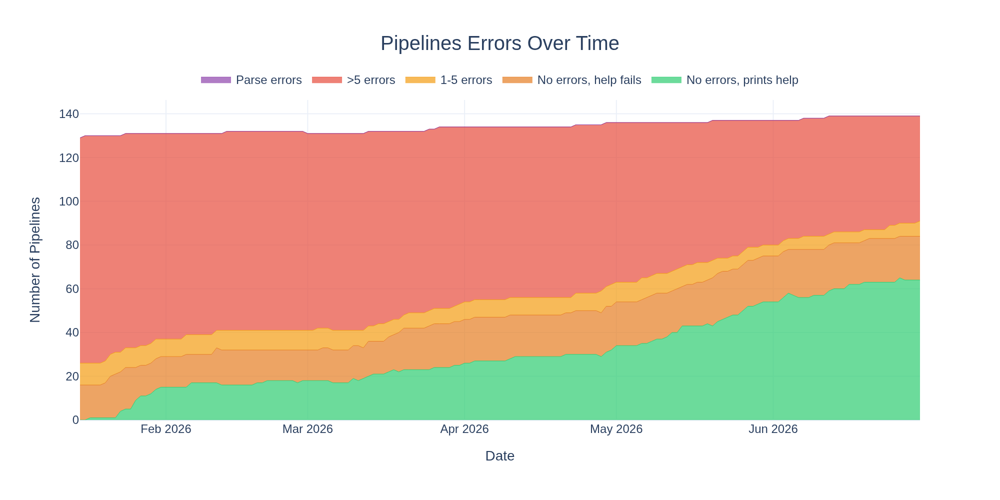
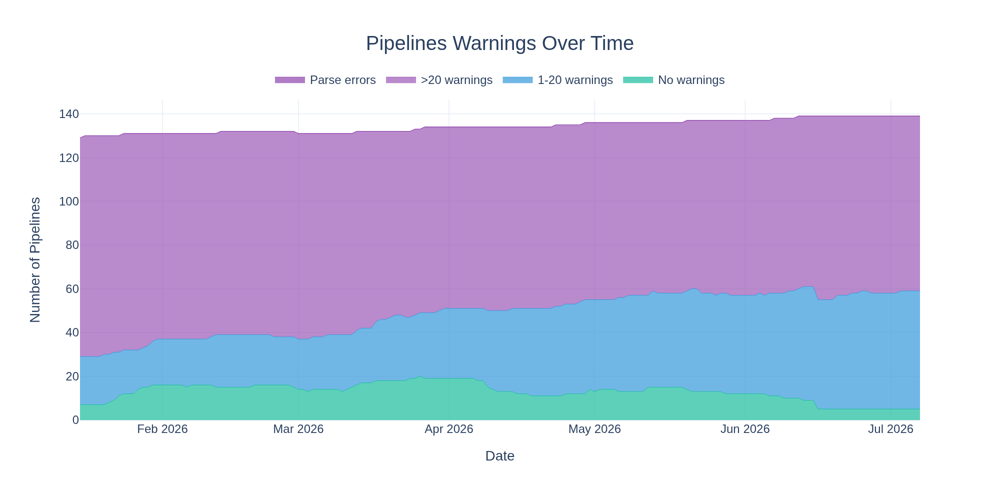
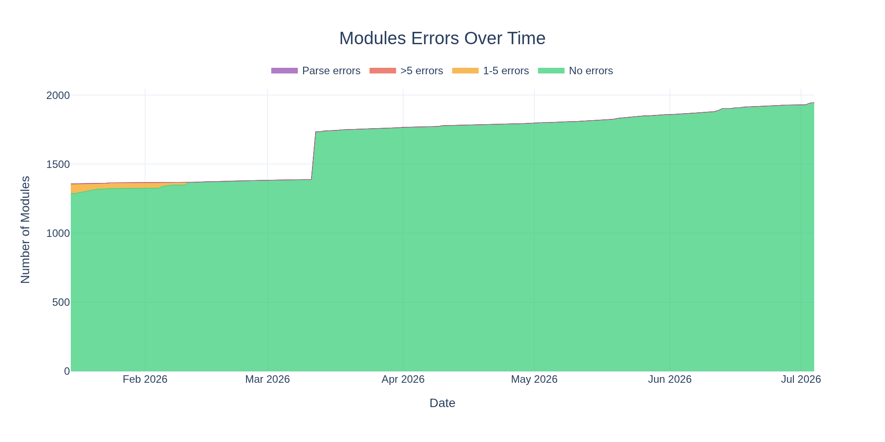
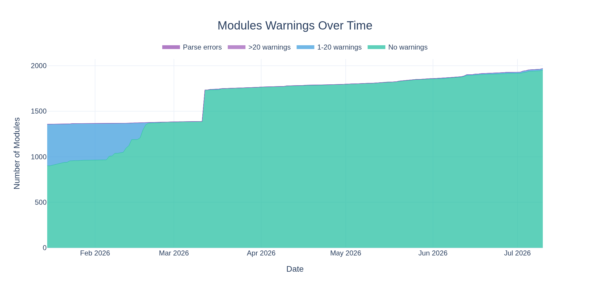
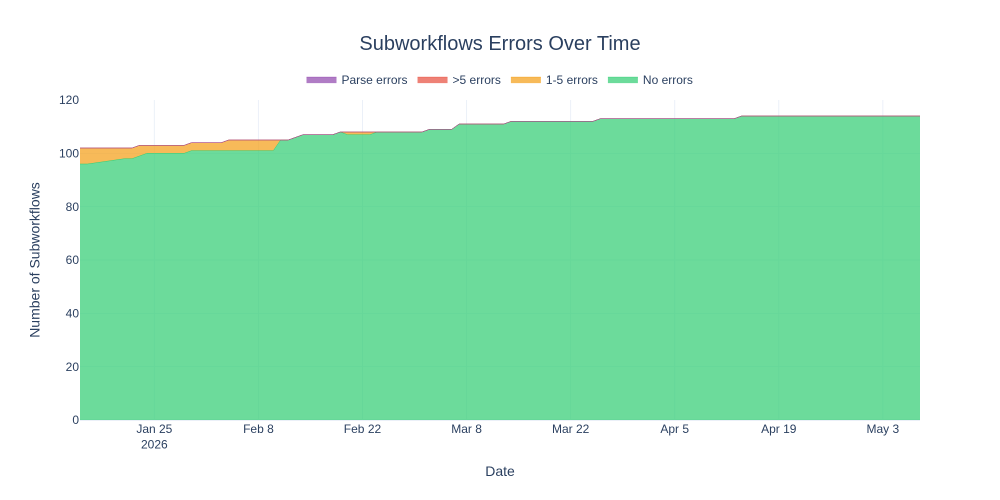
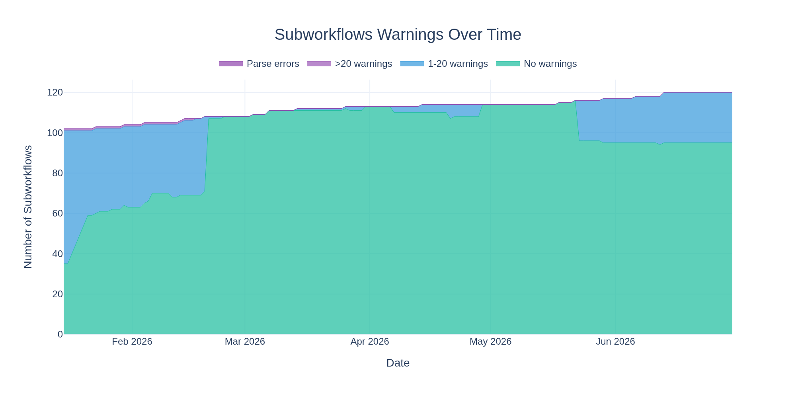

# nf-core Strict Syntax Health Report

This repository tracks the health of nf-core pipelines, modules, and subworkflows with respect to Nextflow's _strict syntax_ linting.

The [Nextflow docs](https://www.nextflow.io/docs/latest/strict-syntax.html) describes the differences from standard Nextflow syntax and includes many examples to help with migration and fixing errors.
Strict syntax is backwards compatible with existing Nextflow code, but enforces stricter rules to catch common errors and improve code quality.

The goal is for all nf-core pipelines to run without errors using strict syntax.

> [!IMPORTANT]
> See the [nf-core blog post](https://nf-co.re/blog/2025/nextflow_syntax_nf-core_roadmap) for details on the migration timeline.
> **Fixing all errors from `nextflow lint` will be a requirement by early spring 2026.**

- **Last updated:** 2026-04-27 00:30:39 UTC
- **Nextflow version:** 26.03.4-edge

## Pipelines

- **Total:** 0 parse errors, 2499 errors, 8113 warnings across 135 pipelines
- **Zero errors:** 50 pipelines (37.0%)

|                    Errors                    |                     Warnings                     |
| :------------------------------------------: | :----------------------------------------------: |
|  |  |

<details>
<summary>Pipeline Results (135 pipelines)</summary>

| Pipeline                                                                                     | Parse Error | Errors | Warnings | Prints Help |                               Lint Output                               |                               Help Output                               |
| -------------------------------------------------------------------------------------------- | :---------: | -----: | -------: | :---------: | :---------------------------------------------------------------------: | :---------------------------------------------------------------------: |
| :x: [airrflow](https://github.com/nf-core/airrflow)                                          |     No      |    188 |      135 |      -      |         [View](lint_results/pipeline-results/airrflow_lint.md)          |                                    -                                    |
| :x: [eager](https://github.com/nf-core/eager)                                                |     No      |    118 |      363 |      -      |           [View](lint_results/pipeline-results/eager_lint.md)           |                                    -                                    |
| :x: [hicar](https://github.com/nf-core/hicar)                                                |     No      |     89 |      122 |      -      |           [View](lint_results/pipeline-results/hicar_lint.md)           |                                    -                                    |
| :x: [genomeannotator](https://github.com/nf-core/genomeannotator)                            |     No      |     85 |      148 |      -      |      [View](lint_results/pipeline-results/genomeannotator_lint.md)      |                                    -                                    |
| :x: [evexplorer](https://github.com/nf-core/evexplorer)                                      |     No      |     75 |       53 |      -      |        [View](lint_results/pipeline-results/evexplorer_lint.md)         |                                    -                                    |
| :x: [differentialabundance](https://github.com/nf-core/differentialabundance)                |     No      |     75 |        9 |      -      |   [View](lint_results/pipeline-results/differentialabundance_lint.md)   |                                    -                                    |
| :x: [diseasemodulediscovery](https://github.com/nf-core/diseasemodulediscovery)              |     No      |     69 |       80 |      -      |  [View](lint_results/pipeline-results/diseasemodulediscovery_lint.md)   |                                    -                                    |
| :x: [scnanoseq](https://github.com/nf-core/scnanoseq)                                        |     No      |     67 |      137 |      -      |         [View](lint_results/pipeline-results/scnanoseq_lint.md)         |                                    -                                    |
| :x: [viralintegration](https://github.com/nf-core/viralintegration)                          |     No      |     66 |       13 |      -      |     [View](lint_results/pipeline-results/viralintegration_lint.md)      |                                    -                                    |
| :x: [oncoanalyser](https://github.com/nf-core/oncoanalyser)                                  |     No      |     64 |      102 |      -      |       [View](lint_results/pipeline-results/oncoanalyser_lint.md)        |                                    -                                    |
| :x: [phageannotator](https://github.com/nf-core/phageannotator)                              |     No      |     59 |       98 |      -      |      [View](lint_results/pipeline-results/phageannotator_lint.md)       |                                    -                                    |
| :x: [cageseq](https://github.com/nf-core/cageseq)                                            |     No      |     56 |       50 |      -      |          [View](lint_results/pipeline-results/cageseq_lint.md)          |                                    -                                    |
| :x: [variantcatalogue](https://github.com/nf-core/variantcatalogue)                          |     No      |     55 |       48 |      -      |     [View](lint_results/pipeline-results/variantcatalogue_lint.md)      |                                    -                                    |
| :x: [readsimulator](https://github.com/nf-core/readsimulator)                                |     No      |     53 |       49 |      -      |       [View](lint_results/pipeline-results/readsimulator_lint.md)       |                                    -                                    |
| :x: [metaboigniter](https://github.com/nf-core/metaboigniter)                                |     No      |     52 |      123 |      -      |       [View](lint_results/pipeline-results/metaboigniter_lint.md)       |                                    -                                    |
| :x: [imcyto](https://github.com/nf-core/imcyto)                                              |     No      |     52 |       14 |      -      |          [View](lint_results/pipeline-results/imcyto_lint.md)           |                                    -                                    |
| :x: [spinningjenny](https://github.com/nf-core/spinningjenny)                                |     No      |     50 |        9 |      -      |       [View](lint_results/pipeline-results/spinningjenny_lint.md)       |                                    -                                    |
| :x: [rnasplice](https://github.com/nf-core/rnasplice)                                        |     No      |     49 |      190 |      -      |         [View](lint_results/pipeline-results/rnasplice_lint.md)         |                                    -                                    |
| :x: [funcprofiler](https://github.com/nf-core/funcprofiler)                                  |     No      |     48 |       53 |      -      |       [View](lint_results/pipeline-results/funcprofiler_lint.md)        |                                    -                                    |
| :x: [radseq](https://github.com/nf-core/radseq)                                              |     No      |     45 |       42 |      -      |          [View](lint_results/pipeline-results/radseq_lint.md)           |                                    -                                    |
| :x: [meerpipe](https://github.com/nf-core/meerpipe)                                          |     No      |     44 |       84 |      -      |         [View](lint_results/pipeline-results/meerpipe_lint.md)          |                                    -                                    |
| :x: [omicsgenetraitassociation](https://github.com/nf-core/omicsgenetraitassociation)        |     No      |     44 |       30 |      -      | [View](lint_results/pipeline-results/omicsgenetraitassociation_lint.md) |                                    -                                    |
| :x: [deepmutscan](https://github.com/nf-core/deepmutscan)                                    |     No      |     43 |       90 |      -      |        [View](lint_results/pipeline-results/deepmutscan_lint.md)        |                                    -                                    |
| :x: [callingcards](https://github.com/nf-core/callingcards)                                  |     No      |     41 |      168 |      -      |       [View](lint_results/pipeline-results/callingcards_lint.md)        |                                    -                                    |
| :x: [lncpipe](https://github.com/nf-core/lncpipe)                                            |     No      |     40 |      176 |      -      |          [View](lint_results/pipeline-results/lncpipe_lint.md)          |                                    -                                    |
| :x: [genomeskim](https://github.com/nf-core/genomeskim)                                      |     No      |     40 |       13 |      -      |        [View](lint_results/pipeline-results/genomeskim_lint.md)         |                                    -                                    |
| :x: [marsseq](https://github.com/nf-core/marsseq)                                            |     No      |     37 |       64 |      -      |          [View](lint_results/pipeline-results/marsseq_lint.md)          |                                    -                                    |
| :x: [nanoseq](https://github.com/nf-core/nanoseq)                                            |     No      |     36 |       43 |      -      |          [View](lint_results/pipeline-results/nanoseq_lint.md)          |                                    -                                    |
| :x: [nascent](https://github.com/nf-core/nascent)                                            |     No      |     34 |      162 |      -      |          [View](lint_results/pipeline-results/nascent_lint.md)          |                                    -                                    |
| :x: [rnadnavar](https://github.com/nf-core/rnadnavar)                                        |     No      |     31 |      371 |      -      |         [View](lint_results/pipeline-results/rnadnavar_lint.md)         |                                    -                                    |
| :x: [multiplesequencealign](https://github.com/nf-core/multiplesequencealign)                |     No      |     31 |      158 |      -      |   [View](lint_results/pipeline-results/multiplesequencealign_lint.md)   |                                    -                                    |
| :x: [denovotranscript](https://github.com/nf-core/denovotranscript)                          |     No      |     31 |       51 |      -      |     [View](lint_results/pipeline-results/denovotranscript_lint.md)      |                                    -                                    |
| :x: [riboseq](https://github.com/nf-core/riboseq)                                            |     No      |     27 |       56 |      -      |          [View](lint_results/pipeline-results/riboseq_lint.md)          |                                    -                                    |
| :x: [scrnaseq](https://github.com/nf-core/scrnaseq)                                          |     No      |     23 |       95 |      -      |         [View](lint_results/pipeline-results/scrnaseq_lint.md)          |                                    -                                    |
| :x: [genomeqc](https://github.com/nf-core/genomeqc)                                          |     No      |     22 |       57 |      -      |         [View](lint_results/pipeline-results/genomeqc_lint.md)          |                                    -                                    |
| :x: [sammyseq](https://github.com/nf-core/sammyseq)                                          |     No      |     21 |      148 |      -      |         [View](lint_results/pipeline-results/sammyseq_lint.md)          |                                    -                                    |
| :x: [hic](https://github.com/nf-core/hic)                                                    |     No      |     21 |       61 |      -      |            [View](lint_results/pipeline-results/hic_lint.md)            |                                    -                                    |
| :x: [mcmicro](https://github.com/nf-core/mcmicro)                                            |     No      |     21 |       48 |      -      |          [View](lint_results/pipeline-results/mcmicro_lint.md)          |                                    -                                    |
| :x: [circdna](https://github.com/nf-core/circdna)                                            |     No      |     21 |       26 |      -      |          [View](lint_results/pipeline-results/circdna_lint.md)          |                                    -                                    |
| :x: [metapep](https://github.com/nf-core/metapep)                                            |     No      |     20 |       52 |      -      |          [View](lint_results/pipeline-results/metapep_lint.md)          |                                    -                                    |
| :x: [datasync](https://github.com/nf-core/datasync)                                          |     No      |     19 |       20 |      -      |         [View](lint_results/pipeline-results/datasync_lint.md)          |                                    -                                    |
| :x: [mhcquant](https://github.com/nf-core/mhcquant)                                          |     No      |     18 |       48 |      -      |         [View](lint_results/pipeline-results/mhcquant_lint.md)          |                                    -                                    |
| :x: [cutandrun](https://github.com/nf-core/cutandrun)                                        |     No      |     17 |      152 |      -      |         [View](lint_results/pipeline-results/cutandrun_lint.md)         |                                    -                                    |
| :x: [phyloplace](https://github.com/nf-core/phyloplace)                                      |     No      |     17 |      106 |      -      |        [View](lint_results/pipeline-results/phyloplace_lint.md)         |                                    -                                    |
| :x: [bactmap](https://github.com/nf-core/bactmap)                                            |     No      |     17 |       31 |      -      |          [View](lint_results/pipeline-results/bactmap_lint.md)          |                                    -                                    |
| :x: [slamseq](https://github.com/nf-core/slamseq)                                            |     No      |     17 |        0 |      -      |          [View](lint_results/pipeline-results/slamseq_lint.md)          |                                    -                                    |
| :x: [pathogensurveillance](https://github.com/nf-core/pathogensurveillance)                  |     No      |     16 |      437 |      -      |   [View](lint_results/pipeline-results/pathogensurveillance_lint.md)    |                                    -                                    |
| :x: [genomeassembler](https://github.com/nf-core/genomeassembler)                            |     No      |     16 |       92 |      -      |      [View](lint_results/pipeline-results/genomeassembler_lint.md)      |                                    -                                    |
| :x: [diaproteomics](https://github.com/nf-core/diaproteomics)                                |     No      |     16 |        0 |      -      |       [View](lint_results/pipeline-results/diaproteomics_lint.md)       |                                    -                                    |
| :x: [clipseq](https://github.com/nf-core/clipseq)                                            |     No      |     15 |        0 |      -      |          [View](lint_results/pipeline-results/clipseq_lint.md)          |                                    -                                    |
| :x: [mnaseseq](https://github.com/nf-core/mnaseseq)                                          |     No      |     15 |        0 |      -      |         [View](lint_results/pipeline-results/mnaseseq_lint.md)          |                                    -                                    |
| :x: [proteogenomicsdb](https://github.com/nf-core/proteogenomicsdb)                          |     No      |     15 |        0 |      -      |     [View](lint_results/pipeline-results/proteogenomicsdb_lint.md)      |                                    -                                    |
| :x: [pangenome](https://github.com/nf-core/pangenome)                                        |     No      |     14 |       63 |      -      |         [View](lint_results/pipeline-results/pangenome_lint.md)         |                                    -                                    |
| :x: [tbanalyzer](https://github.com/nf-core/tbanalyzer)                                      |     No      |     14 |       47 |      -      |        [View](lint_results/pipeline-results/tbanalyzer_lint.md)         |                                    -                                    |
| :x: [rarevariantburden](https://github.com/nf-core/rarevariantburden)                        |     No      |     14 |       23 |      -      |     [View](lint_results/pipeline-results/rarevariantburden_lint.md)     |                                    -                                    |
| :x: [rnafusion](https://github.com/nf-core/rnafusion)                                        |     No      |     13 |      116 |      -      |         [View](lint_results/pipeline-results/rnafusion_lint.md)         |                                    -                                    |
| :x: [detaxizer](https://github.com/nf-core/detaxizer)                                        |     No      |     13 |       61 |      -      |         [View](lint_results/pipeline-results/detaxizer_lint.md)         |                                    -                                    |
| :x: [crisprseq](https://github.com/nf-core/crisprseq)                                        |     No      |     13 |       45 |      -      |         [View](lint_results/pipeline-results/crisprseq_lint.md)         |                                    -                                    |
| :x: [coproid](https://github.com/nf-core/coproid)                                            |     No      |     12 |       46 |      -      |          [View](lint_results/pipeline-results/coproid_lint.md)          |                                    -                                    |
| :x: [spatialxe](https://github.com/nf-core/spatialxe)                                        |     No      |     11 |      116 |      -      |         [View](lint_results/pipeline-results/spatialxe_lint.md)         |                                    -                                    |
| :x: [smrnaseq](https://github.com/nf-core/smrnaseq)                                          |     No      |     11 |       74 |      -      |         [View](lint_results/pipeline-results/smrnaseq_lint.md)          |                                    -                                    |
| :x: [panoramaseq](https://github.com/nf-core/panoramaseq)                                    |     No      |     11 |       25 |      -      |        [View](lint_results/pipeline-results/panoramaseq_lint.md)        |                                    -                                    |
| :x: [hgtseq](https://github.com/nf-core/hgtseq)                                              |     No      |     10 |       69 |      -      |          [View](lint_results/pipeline-results/hgtseq_lint.md)           |                                    -                                    |
| :x: [deepmodeloptim](https://github.com/nf-core/deepmodeloptim)                              |     No      |     10 |       49 |      -      |      [View](lint_results/pipeline-results/deepmodeloptim_lint.md)       |                                    -                                    |
| :x: [tumourevo](https://github.com/nf-core/tumourevo)                                        |     No      |      9 |       60 |      -      |         [View](lint_results/pipeline-results/tumourevo_lint.md)         |                                    -                                    |
| :x: [fastqrepair](https://github.com/nf-core/fastqrepair)                                    |     No      |      9 |       32 |      -      |        [View](lint_results/pipeline-results/fastqrepair_lint.md)        |                                    -                                    |
| :x: [proteinfold](https://github.com/nf-core/proteinfold)                                    |     No      |      9 |        4 |      -      |        [View](lint_results/pipeline-results/proteinfold_lint.md)        |                                    -                                    |
| :x: [hadge](https://github.com/nf-core/hadge)                                                |     No      |      8 |       45 |      -      |           [View](lint_results/pipeline-results/hadge_lint.md)           |                                    -                                    |
| :x: [pacsomatic](https://github.com/nf-core/pacsomatic)                                      |     No      |      7 |      115 |      -      |        [View](lint_results/pipeline-results/pacsomatic_lint.md)         |                                    -                                    |
| :x: [drugresponseeval](https://github.com/nf-core/drugresponseeval)                          |     No      |      7 |       29 |      -      |     [View](lint_results/pipeline-results/drugresponseeval_lint.md)      |                                    -                                    |
| :x: [sopa](https://github.com/nf-core/sopa)                                                  |     No      |      7 |       20 |      -      |           [View](lint_results/pipeline-results/sopa_lint.md)            |                                    -                                    |
| :x: [cellpainting](https://github.com/nf-core/cellpainting)                                  |     No      |      6 |       35 |      -      |       [View](lint_results/pipeline-results/cellpainting_lint.md)        |                                    -                                    |
| :x: [pacvar](https://github.com/nf-core/pacvar)                                              |     No      |      6 |       29 |      -      |          [View](lint_results/pipeline-results/pacvar_lint.md)           |                                    -                                    |
| :x: [fetchngs](https://github.com/nf-core/fetchngs)                                          |     No      |      6 |       26 |      -      |         [View](lint_results/pipeline-results/fetchngs_lint.md)          |                                    -                                    |
| :x: [kmermaid](https://github.com/nf-core/kmermaid)                                          |     No      |      6 |       16 |      -      |         [View](lint_results/pipeline-results/kmermaid_lint.md)          |                                    -                                    |
| :x: [mitodetect](https://github.com/nf-core/mitodetect)                                      |     No      |      6 |       16 |      -      |        [View](lint_results/pipeline-results/mitodetect_lint.md)         |                                    -                                    |
| :x: [troughgraph](https://github.com/nf-core/troughgraph)                                    |     No      |      6 |       16 |      -      |        [View](lint_results/pipeline-results/troughgraph_lint.md)        |                                    -                                    |
| :x: [variantbenchmarking](https://github.com/nf-core/variantbenchmarking)                    |     No      |      5 |       31 |      -      |    [View](lint_results/pipeline-results/variantbenchmarking_lint.md)    |                                    -                                    |
| :x: [methylarray](https://github.com/nf-core/methylarray)                                    |     No      |      4 |       19 |      -      |        [View](lint_results/pipeline-results/methylarray_lint.md)        |                                    -                                    |
| :x: [methylseq](https://github.com/nf-core/methylseq)                                        |     No      |      3 |       66 |      -      |         [View](lint_results/pipeline-results/methylseq_lint.md)         |                                    -                                    |
| :x: [reportho](https://github.com/nf-core/reportho)                                          |     No      |      2 |       90 |      -      |         [View](lint_results/pipeline-results/reportho_lint.md)          |                                    -                                    |
| :x: [dualrnaseq](https://github.com/nf-core/dualrnaseq)                                      |     No      |      2 |       48 |      -      |        [View](lint_results/pipeline-results/dualrnaseq_lint.md)         |                                    -                                    |
| :x: [pairgenomealign](https://github.com/nf-core/pairgenomealign)                            |     No      |      2 |       22 |      -      |      [View](lint_results/pipeline-results/pairgenomealign_lint.md)      |                                    -                                    |
| :x: [lsmquant](https://github.com/nf-core/lsmquant)                                          |     No      |      1 |       43 |      -      |         [View](lint_results/pipeline-results/lsmquant_lint.md)          |                                    -                                    |
| :x: [seqsubmit](https://github.com/nf-core/seqsubmit)                                        |     No      |      1 |       14 |      -      |         [View](lint_results/pipeline-results/seqsubmit_lint.md)         |                                    -                                    |
| :white_check_mark: [sarek](https://github.com/nf-core/sarek)                                 |     No      |      0 |      646 |     Yes     |           [View](lint_results/pipeline-results/sarek_lint.md)           |         [View](lint_results/prints-help-results/sarek_help.txt)         |
| :x: [longraredisease](https://github.com/nf-core/longraredisease)                            |     No      |      0 |      182 |     No      |      [View](lint_results/pipeline-results/longraredisease_lint.md)      |    [View](lint_results/prints-help-results/longraredisease_help.txt)    |
| :x: [viralrecon](https://github.com/nf-core/viralrecon)                                      |     No      |      0 |      180 |     No      |        [View](lint_results/pipeline-results/viralrecon_lint.md)         |      [View](lint_results/prints-help-results/viralrecon_help.txt)       |
| :x: [atacseq](https://github.com/nf-core/atacseq)                                            |     No      |      0 |      165 |     No      |          [View](lint_results/pipeline-results/atacseq_lint.md)          |        [View](lint_results/prints-help-results/atacseq_help.txt)        |
| :white_check_mark: [taxprofiler](https://github.com/nf-core/taxprofiler)                     |     No      |      0 |       94 |     Yes     |        [View](lint_results/pipeline-results/taxprofiler_lint.md)        |      [View](lint_results/prints-help-results/taxprofiler_help.txt)      |
| :white_check_mark: [funcscan](https://github.com/nf-core/funcscan)                           |     No      |      0 |       87 |     Yes     |         [View](lint_results/pipeline-results/funcscan_lint.md)          |       [View](lint_results/prints-help-results/funcscan_help.txt)        |
| :x: [abotyper](https://github.com/nf-core/abotyper)                                          |     No      |      0 |       77 |     No      |         [View](lint_results/pipeline-results/abotyper_lint.md)          |       [View](lint_results/prints-help-results/abotyper_help.txt)        |
| :white_check_mark: [chipseq](https://github.com/nf-core/chipseq)                             |     No      |      0 |       71 |     Yes     |          [View](lint_results/pipeline-results/chipseq_lint.md)          |        [View](lint_results/prints-help-results/chipseq_help.txt)        |
| :x: [methylong](https://github.com/nf-core/methylong)                                        |     No      |      0 |       66 |     No      |         [View](lint_results/pipeline-results/methylong_lint.md)         |       [View](lint_results/prints-help-results/methylong_help.txt)       |
| :x: [molkart](https://github.com/nf-core/molkart)                                            |     No      |      0 |       42 |     No      |          [View](lint_results/pipeline-results/molkart_lint.md)          |        [View](lint_results/prints-help-results/molkart_help.txt)        |
| :x: [stableexpression](https://github.com/nf-core/stableexpression)                          |     No      |      0 |       32 |     No      |     [View](lint_results/pipeline-results/stableexpression_lint.md)      |   [View](lint_results/prints-help-results/stableexpression_help.txt)    |
| :x: [references](https://github.com/nf-core/references)                                      |     No      |      0 |       31 |     No      |        [View](lint_results/pipeline-results/references_lint.md)         |      [View](lint_results/prints-help-results/references_help.txt)       |
| :x: [scdownstream](https://github.com/nf-core/scdownstream)                                  |     No      |      0 |       29 |     No      |       [View](lint_results/pipeline-results/scdownstream_lint.md)        |     [View](lint_results/prints-help-results/scdownstream_help.txt)      |
| :white_check_mark: [mag](https://github.com/nf-core/mag)                                     |     No      |      0 |       22 |     Yes     |            [View](lint_results/pipeline-results/mag_lint.md)            |          [View](lint_results/prints-help-results/mag_help.txt)          |
| :x: [isoseq](https://github.com/nf-core/isoseq)                                              |     No      |      0 |       21 |     No      |          [View](lint_results/pipeline-results/isoseq_lint.md)           |        [View](lint_results/prints-help-results/isoseq_help.txt)         |
| :x: [alleleexpression](https://github.com/nf-core/alleleexpression)                          |     No      |      0 |       20 |     No      |     [View](lint_results/pipeline-results/alleleexpression_lint.md)      |   [View](lint_results/prints-help-results/alleleexpression_help.txt)    |
| :white_check_mark: [circrna](https://github.com/nf-core/circrna)                             |     No      |      0 |       20 |     Yes     |          [View](lint_results/pipeline-results/circrna_lint.md)          |        [View](lint_results/prints-help-results/circrna_help.txt)        |
| :white_check_mark: [bacass](https://github.com/nf-core/bacass)                               |     No      |      0 |       17 |     Yes     |          [View](lint_results/pipeline-results/bacass_lint.md)           |        [View](lint_results/prints-help-results/bacass_help.txt)         |
| :white_check_mark: [rnaseq](https://github.com/nf-core/rnaseq)                               |     No      |      0 |       16 |     Yes     |          [View](lint_results/pipeline-results/rnaseq_lint.md)           |        [View](lint_results/prints-help-results/rnaseq_help.txt)         |
| :white_check_mark: [tfactivity](https://github.com/nf-core/tfactivity)                       |     No      |      0 |       12 |     Yes     |        [View](lint_results/pipeline-results/tfactivity_lint.md)         |      [View](lint_results/prints-help-results/tfactivity_help.txt)       |
| :white_check_mark: [createtaxdb](https://github.com/nf-core/createtaxdb)                     |     No      |      0 |       10 |     Yes     |        [View](lint_results/pipeline-results/createtaxdb_lint.md)        |      [View](lint_results/prints-help-results/createtaxdb_help.txt)      |
| :x: [genephylomodeler](https://github.com/nf-core/genephylomodeler)                          |     No      |      0 |       10 |     No      |     [View](lint_results/pipeline-results/genephylomodeler_lint.md)      |   [View](lint_results/prints-help-results/genephylomodeler_help.txt)    |
| :x: [mspepid](https://github.com/nf-core/mspepid)                                            |     No      |      0 |       10 |     No      |          [View](lint_results/pipeline-results/mspepid_lint.md)          |        [View](lint_results/prints-help-results/mspepid_help.txt)        |
| :x: [hlatyping](https://github.com/nf-core/hlatyping)                                        |     No      |      0 |        9 |     No      |         [View](lint_results/pipeline-results/hlatyping_lint.md)         |       [View](lint_results/prints-help-results/hlatyping_help.txt)       |
| :x: [fastquorum](https://github.com/nf-core/fastquorum)                                      |     No      |      0 |        8 |     No      |        [View](lint_results/pipeline-results/fastquorum_lint.md)         |      [View](lint_results/prints-help-results/fastquorum_help.txt)       |
| :x: [epitopeprediction](https://github.com/nf-core/epitopeprediction)                        |     No      |      0 |        7 |     No      |     [View](lint_results/pipeline-results/epitopeprediction_lint.md)     |   [View](lint_results/prints-help-results/epitopeprediction_help.txt)   |
| :x: [gwas](https://github.com/nf-core/gwas)                                                  |     No      |      0 |        7 |     No      |           [View](lint_results/pipeline-results/gwas_lint.md)            |         [View](lint_results/prints-help-results/gwas_help.txt)          |
| :x: [phaseimpute](https://github.com/nf-core/phaseimpute)                                    |     No      |      0 |        6 |     No      |        [View](lint_results/pipeline-results/phaseimpute_lint.md)        |      [View](lint_results/prints-help-results/phaseimpute_help.txt)      |
| :white_check_mark: [variantprioritization](https://github.com/nf-core/variantprioritization) |     No      |      0 |        5 |     Yes     |   [View](lint_results/pipeline-results/variantprioritization_lint.md)   | [View](lint_results/prints-help-results/variantprioritization_help.txt) |
| :x: [ncrnannotator](https://github.com/nf-core/ncrnannotator)                                |     No      |      0 |        4 |     No      |       [View](lint_results/pipeline-results/ncrnannotator_lint.md)       |     [View](lint_results/prints-help-results/ncrnannotator_help.txt)     |
| :white_check_mark: [genomicrelatedness](https://github.com/nf-core/genomicrelatedness)       |     No      |      0 |        3 |     Yes     |    [View](lint_results/pipeline-results/genomicrelatedness_lint.md)     |  [View](lint_results/prints-help-results/genomicrelatedness_help.txt)   |
| :white_check_mark: [proteinfamilies](https://github.com/nf-core/proteinfamilies)             |     No      |      0 |        3 |     Yes     |      [View](lint_results/pipeline-results/proteinfamilies_lint.md)      |    [View](lint_results/prints-help-results/proteinfamilies_help.txt)    |
| :white_check_mark: [spatialvi](https://github.com/nf-core/spatialvi)                         |     No      |      0 |        3 |     Yes     |         [View](lint_results/pipeline-results/spatialvi_lint.md)         |       [View](lint_results/prints-help-results/spatialvi_help.txt)       |
| :x: [ribomsqc](https://github.com/nf-core/ribomsqc)                                          |     No      |      0 |        2 |     No      |         [View](lint_results/pipeline-results/ribomsqc_lint.md)          |       [View](lint_results/prints-help-results/ribomsqc_help.txt)        |
| :white_check_mark: [ampliseq](https://github.com/nf-core/ampliseq)                           |     No      |      0 |        1 |     Yes     |         [View](lint_results/pipeline-results/ampliseq_lint.md)          |       [View](lint_results/prints-help-results/ampliseq_help.txt)        |
| :white_check_mark: [demultiplex](https://github.com/nf-core/demultiplex)                     |     No      |      0 |        1 |     Yes     |        [View](lint_results/pipeline-results/demultiplex_lint.md)        |      [View](lint_results/prints-help-results/demultiplex_help.txt)      |
| :white_check_mark: [drop](https://github.com/nf-core/drop)                                   |     No      |      0 |        1 |     Yes     |           [View](lint_results/pipeline-results/drop_lint.md)            |         [View](lint_results/prints-help-results/drop_help.txt)          |
| :white_check_mark: [magmap](https://github.com/nf-core/magmap)                               |     No      |      0 |        1 |     Yes     |          [View](lint_results/pipeline-results/magmap_lint.md)           |        [View](lint_results/prints-help-results/magmap_help.txt)         |
| :white_check_mark: [metatdenovo](https://github.com/nf-core/metatdenovo)                     |     No      |      0 |        1 |     Yes     |        [View](lint_results/pipeline-results/metatdenovo_lint.md)        |      [View](lint_results/prints-help-results/metatdenovo_help.txt)      |
| :white_check_mark: [pixelator](https://github.com/nf-core/pixelator)                         |     No      |      0 |        1 |     Yes     |         [View](lint_results/pipeline-results/pixelator_lint.md)         |       [View](lint_results/prints-help-results/pixelator_help.txt)       |
| :white_check_mark: [rangeland](https://github.com/nf-core/rangeland)                         |     No      |      0 |        1 |     Yes     |         [View](lint_results/pipeline-results/rangeland_lint.md)         |       [View](lint_results/prints-help-results/rangeland_help.txt)       |
| :white_check_mark: [raredisease](https://github.com/nf-core/raredisease)                     |     No      |      0 |        1 |     Yes     |        [View](lint_results/pipeline-results/raredisease_lint.md)        |      [View](lint_results/prints-help-results/raredisease_help.txt)      |
| :white_check_mark: [rnavar](https://github.com/nf-core/rnavar)                               |     No      |      0 |        1 |     Yes     |          [View](lint_results/pipeline-results/rnavar_lint.md)           |        [View](lint_results/prints-help-results/rnavar_help.txt)         |
| :white_check_mark: [bamtofastq](https://github.com/nf-core/bamtofastq)                       |     No      |      0 |        0 |     Yes     |        [View](lint_results/pipeline-results/bamtofastq_lint.md)         |      [View](lint_results/prints-help-results/bamtofastq_help.txt)       |
| :white_check_mark: [createpanelrefs](https://github.com/nf-core/createpanelrefs)             |     No      |      0 |        0 |     Yes     |      [View](lint_results/pipeline-results/createpanelrefs_lint.md)      |    [View](lint_results/prints-help-results/createpanelrefs_help.txt)    |
| :white_check_mark: [demo](https://github.com/nf-core/demo)                                   |     No      |      0 |        0 |     Yes     |           [View](lint_results/pipeline-results/demo_lint.md)            |         [View](lint_results/prints-help-results/demo_help.txt)          |
| :white_check_mark: [nanostring](https://github.com/nf-core/nanostring)                       |     No      |      0 |        0 |     Yes     |        [View](lint_results/pipeline-results/nanostring_lint.md)         |      [View](lint_results/prints-help-results/nanostring_help.txt)       |
| :white_check_mark: [proteinannotator](https://github.com/nf-core/proteinannotator)           |     No      |      0 |        0 |     Yes     |     [View](lint_results/pipeline-results/proteinannotator_lint.md)      |   [View](lint_results/prints-help-results/proteinannotator_help.txt)    |
| :white_check_mark: [seqinspector](https://github.com/nf-core/seqinspector)                   |     No      |      0 |        0 |     Yes     |       [View](lint_results/pipeline-results/seqinspector_lint.md)        |     [View](lint_results/prints-help-results/seqinspector_help.txt)      |
| :white_check_mark: [viralmetagenome](https://github.com/nf-core/viralmetagenome)             |     No      |      0 |        0 |     Yes     |      [View](lint_results/pipeline-results/viralmetagenome_lint.md)      |    [View](lint_results/prints-help-results/viralmetagenome_help.txt)    |

</details>

## Modules

- **Total:** 0 parse errors, 0 errors, 2 warnings across 1792 modules
- **Zero errors:** 1792 modules (100.0%)

|                   Errors                   |                    Warnings                    |
| :----------------------------------------: | :--------------------------------------------: |
|  |  |

<details>
<summary>Module Results (0 modules with errors)</summary>

| Module | Parse Error | Errors | Warnings | Lint Output |
| ------ | :---------: | -----: | -------: | :---------: |

_Modules with zero errors are not shown above (1792 modules). They may still have warnings. See the [modules results directory](lint_results/module-results/) for all lint outputs._

</details>

## Subworkflows

- **Total:** 0 parse errors, 0 errors, 10 warnings across 114 subworkflows
- **Zero errors:** 114 subworkflows (100.0%)

|                     Errors                      |                      Warnings                       |
| :---------------------------------------------: | :-------------------------------------------------: |
|  |  |

<details>
<summary>Subworkflow Results (0 subworkflows with errors)</summary>

| Subworkflow | Parse Error | Errors | Warnings | Lint Output |
| ----------- | :---------: | -----: | -------: | :---------: |

_Subworkflows with zero errors are not shown above (114 subworkflows). They may still have warnings. See the [subworkflows results directory](lint_results/subworkflow-results/) for all lint outputs._

</details>

## About

This report is generated daily by running `nextflow lint` on each nf-core pipeline, module, and subworkflow.
The linting checks for strict syntax compliance in Nextflow DSL2 code.

- **Parse errors** indicate items where `nextflow lint` could not run at all, typically due to syntax errors that prevent Nextflow from parsing the code
- **Errors** indicate syntax issues that will cause problems in future Nextflow versions
- **Warnings** indicate deprecated patterns that should be updated, but having warnings is fine (though it's nice to fix those as well if possible)
- **Prints Help** (pipelines only) tests whether the pipeline can print its help message using the v2 syntax parser (`NXF_SYNTAX_PARSER=v2 nextflow run . --help`). This test only runs for pipelines with zero lint errors.

## Running Locally

You can run `nextflow lint` on your own pipeline to check for strict syntax issues:

```bash
nextflow lint .
```

> **Note:** Until [this fix](https://github.com/nextflow-io/nextflow/pull/6716) is included in a Nextflow edge release, you may need to exclude nf-test files manually:
>
> ```bash
> nextflow lint . -exclude ".git,.nf-test,nf-test.config"
> ```

See the [strict syntax documentation](https://www.nextflow.io/docs/latest/strict-syntax.html) for more information about the rules being checked.

## Getting Help

If you need help fixing strict syntax errors in your pipeline, the [Nextflow community forum](https://community.seqera.io/) is a great place to ask questions.
